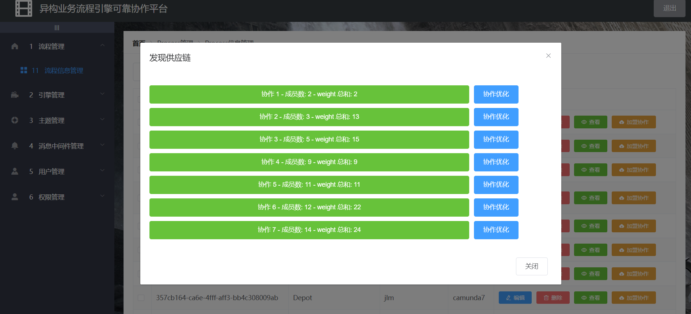
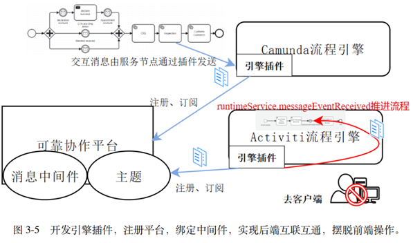
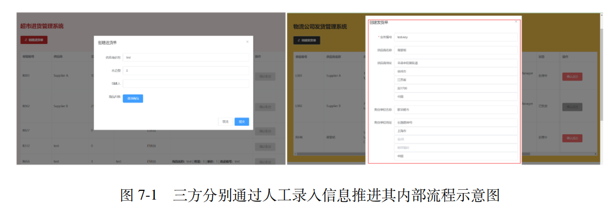
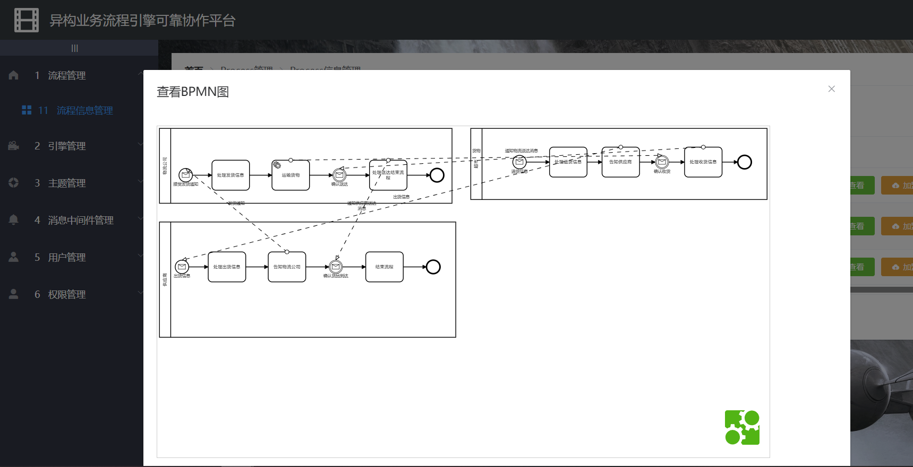

# 自治业务流程系统协作管理平台

本项目为一套用于研究和验证**多主体自治业务流程系统协作机制**的综合性平台，聚焦于流程自治建模、协同发现、服务编排与执行，适用于如大型自动化码头等复杂系统场景的模拟与验证。平台包括前端流程管理界面、后端协作执行服务，以及可复现实验用例。

---

## 项目结构

```
SupervisoryManageFrontend/          # 前端：协作流程可视化与管理界面
SupervisoryManagement/              # 后端：流程调度与服务通信逻辑

系统演示.mp4

大型自动化码头仿真case/            # 仿真用例（含流程引擎与外部服务）
├── Engines/                        # 9个协作者的业务流程引擎
└── Tasks/                          # 各协作者的外部服务（含 Kafka 通信）
超市供应链case/                   # 仿真用例（流程引擎与服务耦合）
└── SBGS-engines/ 
流程首页.png                        # 主流程页面截图
发现供应链.png                      # “发现供应链”功能截图
发现大型自动化码头仿真协作图.png    # 仿真协作图谱示意截图

```


---

## SupervisoryManageFrontend（前端）

基于 Vue.js 的可视化界面，支持流程图展示、协作发现、流程运行状态观察等功能。

### 环境要求

- Node.js 版本：14.x
- npm 版本：6.x

### 安装与运行

```bash
cd SupervisoryManageFrontend
npm install
npm run serve
```


### 页面说明

- `流程首页.png`：平台流程主视图

  

- `发现供应链.png`：协作发现入口界面截图

  

- `发现大型自动化码头仿真协作图.png`：发现后的示例协作图

  

------

## SupervisoryManagement（后端）

使用 Spring Boot 构建的后端服务，实现流程调度执行、任务协调、Kafka 通信等功能。

### 环境要求

- Java 8 及以上版本

### 启动方式

```bash
cd SupervisoryManagement
./mvnw spring-boot:run
```

------


演示视频.mp4在当前目录夹下，可以查看示例视频


## 大型自动化码头仿真 Case

`大型自动化码头仿真case/` 目录为平台的示例应用，每一个项目都是一个SpringBoot项目，包含 9 个协作者的完整流程和任务服务实现，支持复现实验。



### Engines/

每个子文件夹为一个协作者的业务流程建模与执行引擎，基于 BPMN 等标准实现。

### Tasks/

每个协作者对应的外部服务逻辑，包括实际任务、服务调用、Kafka 通信接口。

#### Kafka 配置说明（所有 Task 服务需配置）

每个外部服务应在其 `application.yml` 中设置以下 Kafka 信息：

```yaml
spring:
  kafka:
    bootstrap-servers: blade04.soaringlab.top:9092
    producer:
      value-serializer: org.apache.kafka.common.serialization.StringSerializer
```

------

`## 超市供应链 Case`

运行SupervisoryManageFrontend、SBGS-engines
超市前端：http://localhost:8888/supermarket
供应商前端：http://localhost:8888/supplier
物流前端：http://localhost:8888/logistics

三方集成后的前端：http://localhost:8888/logistics

在传统的超市、供应商、物流公司三方协作模式中，企业内部的员工分别通过独立的业务系统进行信息录入，手动协调供应链中各自的流程节点。具体而言，超市的业务人员需要在内部系统中发起进货流程，供应商和物流公司则分别由员工在对应系统中接收进货订单和发货通知，按序推进各自的流程。由于三方信息通过人工输入更新，协作效率依赖于员工的手动操作和企业间的对接，协作过程中信息滞后、错误率高等问题较为明显。

下图展示了三方在传统模式下的操作流程，描述了每个企业内部员工如何录入和接收信息，以推进其业务流程。本视图仅示意超市（左）与物流公司（右）的各自客户端系统。物流公司的客户端使用人员除了货物基本信息外需要录入复杂的地址信息。



在协作平台的支持下，超市、供应商、物流公司三方可以通过“供应链发现”功能生成自动协作模型。平台通过流程的发现与组合，帮助超市、供应商和物流公司快速建立跨企业的协作关系，并实现流程的自动触发和进展。




三个具体的遗留 PAIS 在通过插件改造后，超市发起进货流程时，系统根据订阅的消息主题自动通知供应商和物流公司，三方流程同步启动。系统的实时消息传递机制确保了业务流程的高效运行，自动化的流程集成显著减少了人工干预，使得协作更加快速、可靠，满足了更大的业务价值需求。

本实验对比了传统模式和平台模式下三方协作的执行效率、信息同步时间和错误率。实验结果表明，基于协作平台的模式在多个方面具备显著优势：

1. **执行效率提升**：在传统模式下的超市-供应商-物流协作，人工录入商品、货物信息平均耗时约 2 分钟；而在平台模式下，由于流程的自动触发和消息传递，协作流程平均耗时降至秒级。

2. **信息同步时间缩短**：在传统模式中，由于依赖手动更新信息，信息同步时间较长，且容易受到人为操作的延迟影响。在平台模式下，系统通过实时的消息订阅机制实现了信息的即时传递，有效缩短了同步时间，保证了各方流程的同步。

3. **错误率降低**：传统模式下因信息手动录入导致的错误率较高，通过平台自动化的协作流程，消除了手动输入环节中的错误风险，显著提升了流程的准确性。

由此可见，基于协作平台的自动化模式有效提升了超市、供应商、物流公司三方的协作效率，减少了因人工操作带来的误差。平台模式确保了在三方协作流程中信息的实时性与准确性，为企业间的高效协作提供了可靠的技术支撑。

在该实验中，通过供应链发现功能，平台能够识别三方流程中存在的协作点，生成一个跨企业的协作模型，并将该模型部署在平台上。部署完成后，平台将超市的进货流程与供应商的供货流程和物流公司的发货流程进行对接。进货流程一旦在超市的业务系统中启动，平台便会向供应商和物流公司的流程引擎发送消息，通过订阅的主题实现流程之间的消息传递。

平台通过自动化机制，使三方流程从彼此独立的状态转变为互联的整体，确保了供应链协作的连贯性和实时性。

图 7-2 展示了在平台支持下，通过第三章所述的启发式搜索，可以正确搜索到超市供应链中三方企业组成的协作模型，他们彼此进行消息交互，发起流程、推进流程使流程到达终态。


## 学术背景与适用范围

本平台适用于如下研究方向：

- 自治式业务流程建模与执行
- 多主体协同发现与匹配机制
- 跨服务流程编排与集成
- 仿真驱动的系统验证与协作评估

可服务于智能制造、港口物流、城市系统等领域的系统协同仿真研究。

