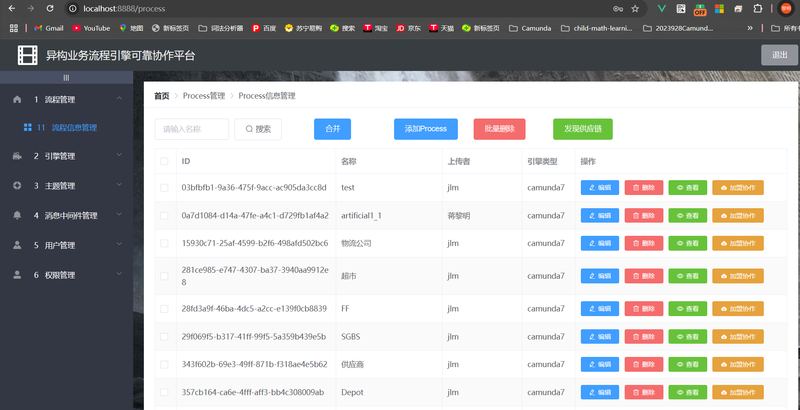

# 自治业务流程系统协作管理平台

本项目为一套用于研究和验证**多主体自治业务流程系统协作机制**的综合性平台，聚焦于流程自治建模、协同发现、服务编排与执行，适用于如大型自动化码头等复杂系统场景的模拟与验证。平台包括前端流程管理界面、后端协作执行服务，以及可复现实验用例。

---

## 项目结构

.
 ├── SupervisoryManageFrontend/             # 前端：协作流程可视化与管理界面
 ├── SupervisoryManagement/                 # 后端：流程调度与服务通信逻辑
 ├── 大型自动化码头仿真case/                 # 仿真用例（含流程引擎与外部服务）
 │   ├── Engines/                           # 9个协作者的业务流程引擎
 │   └── Tasks/                             # 各协作者的外部服务（含 Kafka 通信）
 ├── 流程首页.png                            # 主流程页面截图
 ├── 发现供应链.png                          # “发现供应链”功能截图
 └── 发现大型自动化码头仿真协作图.png        # 仿真协作图谱示意截图

---

## SupervisoryManageFrontend（前端）

基于 Vue.js 的可视化界面，支持流程图展示、协作发现、流程运行状态观察等功能。

### 环境要求

- Node.js 版本：14.x
- npm 版本：6.x

### 安装与运行

```bash
cd SupervisoryManageFrontend
npm install
npm run serve
```


### 页面说明

- `流程首页.png`：平台流程主视图

  

- `发现供应链.png`：协作发现入口界面截图

  

- `发现大型自动化码头仿真协作图.png`：发现后的示例协作图

  

------

## SupervisoryManagement（后端）

使用 Spring Boot 构建的后端服务，实现流程调度执行、任务协调、Kafka 通信等功能。

### 环境要求

- Java 8 及以上版本

### 启动方式

```bash
cd SupervisoryManagement
./mvnw spring-boot:run
```

------

## 大型自动化码头仿真 Case

`大型自动化码头仿真case/` 目录为平台的示例应用，每一个项目都是一个SpringBoot项目，包含 9 个协作者的完整流程和任务服务实现，支持复现实验。

### Engines/

每个子文件夹为一个协作者的业务流程建模与执行引擎，基于 BPMN 等标准实现。

### Tasks/

每个协作者对应的外部服务逻辑，包括实际任务、服务调用、Kafka 通信接口。

#### Kafka 配置说明（所有 Task 服务需配置）

每个外部服务应在其 `application.yml` 中设置以下 Kafka 信息：

```yaml
spring:
  kafka:
    bootstrap-servers: blade04.soaringlab.top:9092
    producer:
      value-serializer: org.apache.kafka.common.serialization.StringSerializer
```

------

## 学术背景与适用范围

本平台适用于如下研究方向：

- 自治式业务流程建模与执行
- 多主体协同发现与匹配机制
- 跨服务流程编排与集成
- 仿真驱动的系统验证与协作评估

可服务于智能制造、港口物流、城市系统等领域的系统协同仿真研究。

